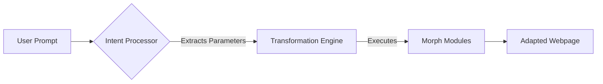

<div align="center">

   

  # **✨ EasyView Morph Engine**

  **"The web adapted to you, not the other way around."**

  [](https://github.com/iapoorv01/EasyView-Morph-Engine)
  [](LICENSE)
  [](https://chrome.google.com/webstore)
  [](#)

  *A prompt-driven website personalization engine.*

</div>

---

## 🌊 The Problem: A Rigid Web
**Every website on the internet follows a one-size-fits-all approach.**

Whether you are a student preparing for exams, a professional under pressure, a dyslexic reader, or a senior citizen, you are forced to consume information through the same interface dictated by developers. For years, users have had to adapt to platforms. 

> *"What if you could talk to your browser and tell it how you want the web to look?"*

---

## ✨ The Solution: Morph Engine
**Morph Engine gives control back to the user.**
We leverage natural language understanding to dynamically transform any website's layout, structure, styling, and content presentation.

Instead of: **Website → User adapts**  
Morph Engine enables: **User → Website adapts**

<div align="center">
   
### **The Transformation**
| **Your Prompt** | **Morph Engine Action** |
| :--- | :--- |
| *"Hide YouTube Shorts"* | Injects dynamic CSS to remove Shorts from feeds and sidebars. |
| *"Convert into Study Mode"* | Removes ads, expands typography, and changes contrast for deep focus. |
| *"Make this senior friendly"* | Increases font sizes and simplifies complex navigation elements. |
</div>

---

## 🚀 Key Features (V1 Foundation)

### 🧠 **Intent Understanding Layer**
*   **Prompt-Driven UI:** A clean, accessible popup interface to capture user intent.
*   **Natural Language Processing:** Placeholder architecture ready for LLM zero-shot classification to interpret exactly what the user wants.

### ⚙️ **Transformation Engine**
*   **Dynamic DOM Manipulation:** Safely applies complex CSS and structural changes on the fly.
*   **State Orchestration:** Keeps track of active morphs and gracefully reverts them when needed.

### 🎭 **Morph Implementations**
*   **Study Mode:** Instantly strips away sidebars, ads, and visual noise, replacing them with a warm, high-contrast reading environment.
*   **Custom Filters:** Hide specific platform features like YouTube Shorts to reclaim your attention.

---

## 💻 How to Install (Developer Mode)

Since this is an active R&D repository, it is installed via Chrome Developer Mode:

1. Clone this repository to your local machine:
   ```bash
   git clone https://github.com/iapoorv01/EasyView-Morph-Engine.git
   ```
2. Open Google Chrome and navigate to `chrome://extensions/`.
3. Enable **Developer mode** using the toggle in the top right corner.
4. Click the **Load unpacked** button.
5. Select the `easyview-morph-engine` folder you just cloned.
6. The extension is now installed! Click the puzzle icon in Chrome to pin it and try out a prompt.

---

## ⚙️ How It Works

EasyView Morph Engine acts as an intelligent abstraction layer between the browser DOM and the user's intent.



1.  **Understand:** Captures raw natural language and translates it into an actionable intent.
2.  **Orchestrate:** The engine checks available Morph capabilities for the current site.
3.  **Transform:** The appropriate DOM changes (CSS, structure) are seamlessly injected.

---

## 🛠️ Tech Stack

*   **Frontend:** JavaScript, HTML, Vanilla CSS (EasyView branding)
*   **Core:** Chrome Extension APIs (Manifest V3)
*   **Intelligence:** Expandable Architecture for LLM Integration
*   **Execution:** Modular OOP-based morph execution pipeline

---

## 🗺️ 3rd Year Extension Path (Roadmap)

This project is structured as a continuous 3rd-year engineering extension track, designed to evolve from a basic rule-based extension into a fully autonomous, AI-driven accessibility platform. *(Note: This roadmap is subject to change based on project circumstances and technical discoveries).*

### Phase 1: Prompt-Based Website Transformation (Current)
- Build the core V1 extension architecture.
- Implement the baseline DOM manipulation engine and popup UI.
- Create hardcoded example morphs (e.g., Study Mode, Hide YouTube Shorts).

### Phase 2: Context-Aware Adaptation & Detection
- Implement automatic website-type detection (e.g., recognizing Video Platforms vs. Educational Sites).
- Proactively recommend appropriate morphs to the user before they even type a prompt.

### Phase 3: Persistent Personalization (Morph Profiles)
- Build the "Morph Profiles" system.
- Allow users to save custom morph combinations (e.g., "ADHD Focus Mode", "Senior Mode").
- System learns user preferences over time and auto-applies them to specific domains.

### Phase 4: Community Morph Marketplace
- Enable users to publish and share their custom morph scripts.
- Integrate a cloud database to browse, rate, and download community-driven website fixes.

### Phase 5: Fully Generative Morphs (LLM Integration)
- Connect the Intent Processor directly to an LLM (e.g., Amazon Nova).
- Allow users to describe arbitrary visual changes, and have the AI generate the exact CSS/JS transformation plan dynamically based on the current DOM context.

---

<br/>

<div align="center">
  <b>Extended from EasyView.</b><br/>
  © EasyView. All Rights Reserved. <br/><br/>
  <i>Made with ❤️ for an accessible, personalized web.</i>
</div>
