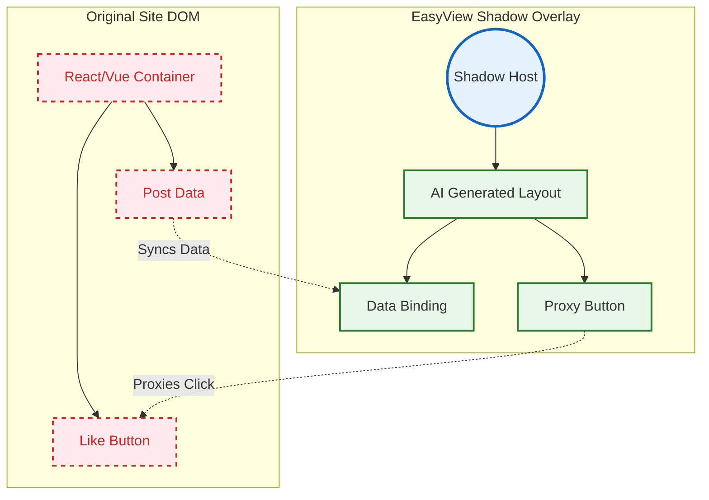

# ADR-001: Data-Driven Shadow Overlay (`ShadowMorph`)

> **Status:** Accepted (Initial Implementation Phase)
> **Date:** June 2026

---

## 🏗️ Context

> [!NOTE]
> **The Challenge of Modern Web Frameworks**
> Modern web frameworks (like React, Angular, and Vue) maintain strict control over the Virtual DOM. Arbitrarily deleting or deeply mutating elements within the active DOM tree often causes the underlying application to crash, break event listeners, or lose state synchronization.

The EasyView Morph Engine aims to enable users to fundamentally alter the layout, styling, and interaction model of complex web applications (e.g., turning a vertical infinite-scroll feed into a paginated UI) using natural language prompts. To provide a seamless morphing experience without breaking the site's core functionality (like data fetching and state management), we need a **safe mechanism to render AI-generated custom UIs on top of existing applications.**

---

## 🎯 Decision

> [!IMPORTANT]
> **Data-Driven Shadow Overlay**
> For the initial implementation of the V2 Dynamic UI morphing pipeline, we have selected the `ShadowMorph` strategy. This approach creates an isolated, data-synced presentation layer without manipulating the underlying framework state.

### The Execution Flow

1. **Hide, Don't Delete:** Visually hide the original target container (`visibility: hidden`, `position: absolute`) instead of removing it from the DOM.
2. **Mount Shadow Host:** Inject a new `
` immediately after the hidden target and attach a secure `ShadowRoot`.
3. **Render & Bind:** Render the LLM-generated UI template inside the Shadow DOM. Read data (`innerHTML`, image `src`) from the original hidden elements and inject it into the new template.
4. **Action Proxying:** Add event listeners to the interactive elements in the Shadow DOM that map directly to and execute `.click()` events on the hidden original UI.

### Architecture Diagram

*Note: This architecture is the selected approach for our initial V2 implementation. It will be continually validated through real-world testing and may be superseded if empirical data suggests a better approach.*

---

## ⚖️ Consequences

### ✨ Benefits

| Benefit | Description |
| :--- | :--- |
| **🛡️ Framework Safety** | The native app state remains 100% intact. React is completely unaware that its UI is visually hidden, preventing crashes. |
| **🎨 CSS Isolation** | Total encapsulation. Injected styles will not leak and break the host site, nor will the site's CSS distort our custom UI. |
| **🚀 Boundless Flexibility** | The LLM can generate drastically different UI paradigms (3D, CLI-style, newspaper grid) limited only by data mapping. |

### ⚠️ Trade-offs & Risks

> [!WARNING]
> Keep an eye on these potential friction points during development:

- **Data Sync Overhead:** Keeping the Shadow UI in sync with the hidden original UI requires active `MutationObserver` loops. Rapid DOM changes (like fast infinite scrolling) could introduce rendering lag.
- **Brittle Proxies:** Proxying simple clicks is easy; proxying complex drag-and-drop actions, continuous hover states, or multifaceted form inputs will be highly challenging.
- **Memory Consumption:** Maintaining the hidden original UI alongside our active Shadow UI creates two simultaneous presentation layers, potentially increasing the browser memory footprint on heavy web apps.

---

## 🔍 Alternatives Considered

| Approach | Summary | Why it was Rejected |
| :--- | :--- | :--- |
| **Direct DOM Mutation (V1)** | In-place CSS/JS injection directly into the site's active DOM tree. | Severely limits structural changes. Moving elements outside their React parents instantly crashes the application. |
| **Backend Page Proxying** | Fetching raw data via a proxy server and rendering a completely new frontend. | Breaks local session authentication (cookies/tokens), disrupts WebSockets, and requires costly server infrastructure. |
| **Iframe Sandboxing** | Loading the site in a hidden `<iframe>` and projecting scraped data to the main window. | Blocked by modern `X-Frame-Options` and strict CORS policies. Heavy performance penalties on load times. |

