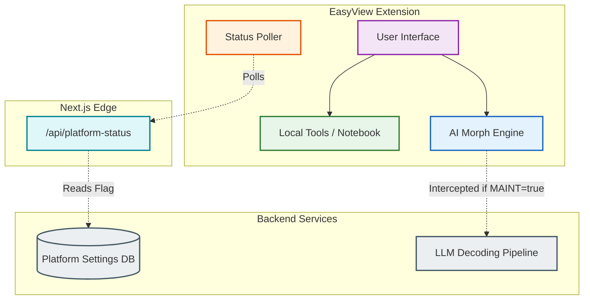

# ADR-003: Informative Maintenance & Graceful Degradation Architecture

> **Status:** Accepted
> **Date:** July 2026

---

## 🏗️ Context

> [!NOTE]
> **The Problem with Hard-Lock Maintenance**
> Traditional SaaS platforms often utilize a "hard-lock" maintenance mode, intercepting all requests with HTTP 503 pages during backend updates. For a browser extension integrated deeply into a user's daily workflow, a hard-lock is highly destructive. Users lose access to purely local, non-server dependent tools (like the Markdown Notebook, cached prompts, or basic UI customization) simply because the cloud LLM pipeline is undergoing maintenance.

As the EasyView ecosystem scales, we require the ability to take our backend AI decoding pipelines offline for upgrades without entirely bricking the extension for end-users. We need a flexible architecture that informs users of downtime while gracefully degrading functionality.

---

## 🎯 Decision

> [!IMPORTANT]
> **Informative over Blocking UX**
> We have opted for a "Graceful Degradation" strategy. Instead of blocking the entire platform, we have decoupled local extension execution from cloud service health, utilizing a persistent UI badging system and edge-level status checks.

### The Execution Flow

1. **Decoupled Edge Heartbeat:** The frontend continuously polls a lightweight, heavily cached `/api/platform-status` endpoint rather than waiting for an actual AI request to fail.
2. **Transparent Badging:** Upon detecting `maintenance_mode: true`, the extension injects a non-intrusive, GPU-accelerated animated wrench badge (`🛠️ MAINT`) directly into the persistent UI Header, alerting the user immediately without blocking interactions.
3. **Graceful Action Interception:** If a user attempts to execute a cloud-reliant feature (like an AI Morph Request) during maintenance, the client intercepts the request before it fires. Instead of a generic error, it renders a sleek glassmorphic modal explaining the situation and offering a "Retry" or "Dismiss" action.
4. **Local Resilience:** All local-first tools (history, notebooks, settings overrides) remain completely unhindered and fully operational.

### Architecture Diagram

---

## ⚖️ Consequences

### ✨ Benefits

| Benefit | Description |
| :--- | :--- |
| **🛡️ Continuous Utility** | Users can still utilize the extension for local workflows, preserving trust and preventing uninstalls during extended backend maintenance. |
| **🎨 Premium Transparency** | The animated badging and explicit modal interceptors feel highly professional, setting clear expectations rather than leaving users guessing why a request failed. |
| **⚡ Edge Efficiency** | The `/api/platform-status` endpoint is lightweight and cacheable, preventing the main database from being hammered by failing complex queries during an outage. |

### ⚠️ Trade-offs & Risks

> [!WARNING]
> Keep an eye on these potential friction points during development:

- **State Desync:** Users leaving the extension open indefinitely might not poll the status frequently enough, leading to a late intercept when they finally trigger a cloud action.
- **Support Volume:** Users who ignore the maintenance badge might still submit support tickets wondering why the AI feature specifically isn't working.

---

## 🔍 Alternatives Considered

| Approach | Summary | Why it was Rejected |
| :--- | :--- | :--- |
| **Global 503 Overlay** | Covering the entire extension popup with a "Under Maintenance" blocking overlay. | Traps users. Prevents access to local features and saved notes, leading to extreme frustration. |
| **Silent Degradation** | Allowing cloud requests to silently fail or timeout with a standard browser error. | Unprofessional. Users assume the product is permanently broken rather than temporarily offline. |
