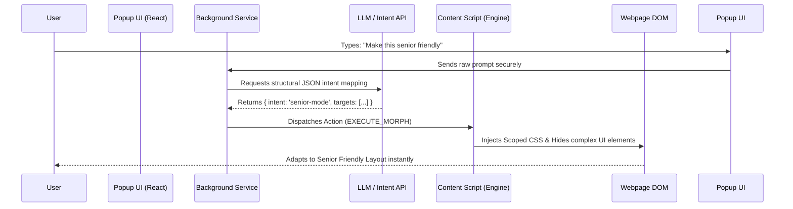

  
  <h1>Product Design Document: Morph Engine</h1>
  
<b>Universal Web Layout Customization & AI-Driven DOM Transformation</b>

---

**Target Repository:** `https://github.com/iapoorv01/EasyView.git`  
**Public Release:** Chrome Web Store & [easyview.in](https://easyview.in)

---

## 1. Executive Summary

The **EasyView Morph Engine** is a revolutionary subsystem designed to grant users complete control over the visual presentation and structural layout of *any* website on the internet. 

Whether a user is browsing a rigid government portal, a chaotic news website, a complex banking application, or an overwhelming educational platform, the Morph Engine allows them to use natural language to reshape the UI to fit their specific cognitive, sensory, or accessibility needs.

**Core Philosophy:** *The user dictates the interface, not the platform.*

---

## 2. Product Capabilities

### 2.1 Universal Website Compatibility
The engine is designed to operate seamlessly on **any standard HTML/CSS/JS webpage**. 
- **DOM Traversal:** Dynamically maps and identifies critical containers (navbars, main content, sidebars, ad slots) regardless of the website's underlying framework.
- **Government & Legacy Sites:** Specifically engineered to safely scale fonts, increase contrast, and simplify the rigid tables and dense layouts often found in public infrastructure websites.
- **Modern SPA Platforms:** Compatible with React, Vue, and Angular sites through dynamic `MutationObserver` hooks that automatically re-apply morphs as the page changes dynamically without reloading.

### 2.2 Core Feature Set
1. **Natural Language Morphing:** Prompts like *"Make this look like a printed book"*, *"Hide all images and videos"*, or *"Make the text massive and high contrast"* directly manipulate the UI.
2. **Persistent Profiles:** Users can save a morph configuration (e.g., "Government Portal Readable Mode") and set it to auto-apply whenever they visit specific domains.
3. **Reversible State Architecture:** Every DOM manipulation is non-destructive. A robust rollback system undoes modifications with a single click, instantly restoring the website's original state.

---

## 3. System Architecture & Data Flow

---

## 4. Main Extension Integration Strategy 

This standalone repository (`EasyView-Morph-Engine`) serves as the **isolated R&D environment** for internship tracking and rapid prototyping. Once the V1/V2 architecture is approved, integration into the main `EasyView` monorepo will execute as follows:

1. **Module Porting:** The core `/engine` and `/morphs` directories will be merged directly into the main EasyView `src/content/` directory.
2. **UI Merging:** The Morph Engine's text-input interface will be integrated as a primary "Morph" tab alongside existing tools inside the main React/Tailwind popup.
3. **State & Auth Unification:** Morph Engine's profile settings will natively bind to EasyView's existing Supabase user authentication and Chrome Sync storage architecture.
4. **API Convergence:** Morph Engine will utilize EasyView's established `Amazon Nova / Gemini` backend API routes to parse intent, preventing duplicate API infrastructure.

---

## 5. Distribution & Go-To-Market

The Morph Engine will not ship as a fragmented, separate extension. It will launch as the **flagship feature** of a major EasyView platform update.

*   **Website Landing Page:** Prominently featured on [easyview.in](https://easyview.in) as "The Ultimate Web Customizer."
*   **Chrome Web Store:** The store listing assets and descriptions will be updated to highlight "AI-Powered Website Redesign."
*   **GitHub Releases:** Transparent, versioned open-source releases pushed directly to [EasyView Repository](https://github.com/iapoorv01/EasyView.git). 
*   **Community Marketplace (Future):** Users will eventually publish and share their custom morph scripts on `easyview.in` (e.g., "Best YouTube Distraction Free Morph").

---

## 6. Security & Accessibility Safeguards

- **Zero Data Exfiltration:** The Morph Engine only modifies local DOM state. It does **not** read, scrape, or transmit sensitive user data (passwords, banking info, emails). Only the specific *prompt text* is securely sent to the API.
- **CSS Isolation:** All injected styles use highly specific, isolated class wrappers to guarantee they do not accidentally break critical website functionality (e.g., checkout buttons or login forms).
- **In-House Accessibility (a11y):** The UI of the Morph Engine itself adheres strictly to WCAG 2.1 AA standards, ensuring that users relying on screen readers or keyboard navigation can easily activate the morphs designed to help them.

---
 

<i>This document serves as the formal architectural blueprint and product specification for the EasyView Morph Engine.</i>

